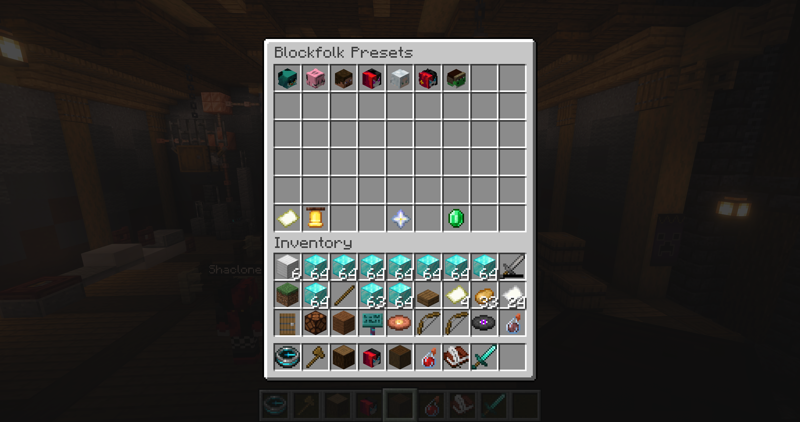
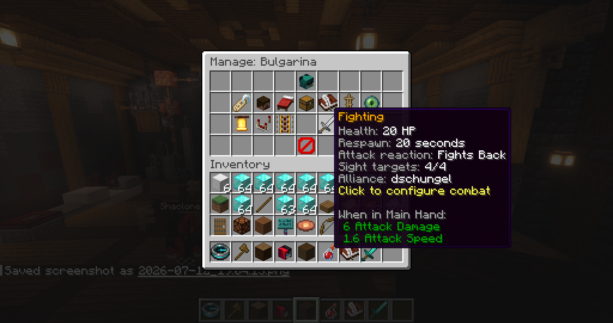
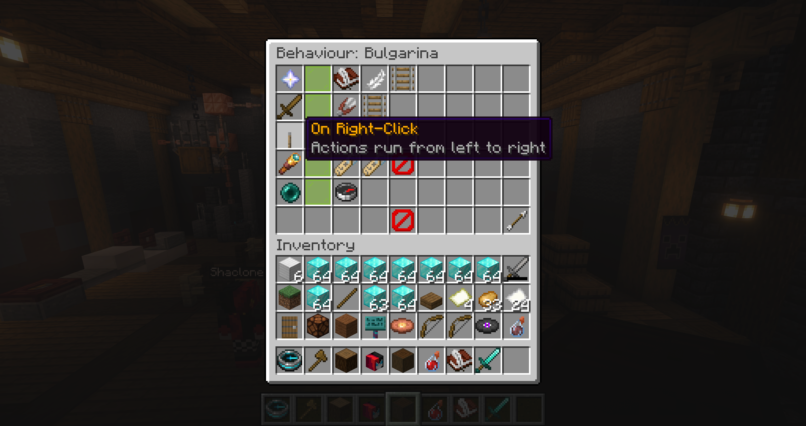

<p align="center">
  
</p>

<h1 align="center">Blockfolk</h1>

Blockfolk is a GUI-driven fake-player NPC system for Paper servers. It supports reusable NPC presets, persistent instances, skins, equipment, dialog, combat behaviour, and walking routes.

## BeautyQuests integration

BeautyQuests is an optional soft dependency. When it is installed, every spawned
Blockfolk NPC is available in BeautyQuests' NPC selector. Create or edit a quest,
choose an NPC-based starter or stage, then click the Blockfolk NPC in the world.
Quest dialogs, interaction stages, markers, and navigation pausing use the same
persistent NPC instance UUID, so assignments survive server restarts.
BeautyQuests editor entries assigned to Blockfolk NPCs use the NPC's skinned
player head as their icon.

## Commands

All commands require the `blockfolk.admin` permission (granted to operators by default).

- `/bf` or `/blockfolk` — open the Blockfolk preset UI.
- `/bf create` — start creating an NPC and enter its name in chat.
- `/bf create <name>` — create an NPC preset with the supplied name.
- `/bf npc <name>` — open the editor for an NPC preset. NPC names are tab-completed.
- `/bf routes` — open the route manager.
- `/bf npc <name> spawn` — spawn a persistent copy of the selected NPC preset.
- `/bf npc <name> duplicate` — duplicate a preset with ` (copy)` appended to its display name.

When a preset has exactly one instance, its `Manage Instances` entry provides shortcuts:
shift-left-click teleports you to the NPC, and shift-middle-click moves the NPC and its
respawn location to you. Removing an individual instance requires confirmation.

Combat respawns retain the persistent instance UUID and their pending deadline across
server restarts, so integrations such as BeautyQuests continue referring to the same NPC.
NPC mining, harvesting, and container transfers emit cancellable Bukkit events so region,
claim, and logging plugins can reject or observe those changes.

Dialog line duration is calculated automatically from the text length at 12 characters
per second, with a minimum duration of 3 seconds.

Proximity enter/leave transitions are debounced for 3 seconds by default. Adjust
`proximity-transition-cooldown-seconds` in `config.yml` if needed.

## AI Behaviour

AI Behaviour is configured directly from an NPC preset's dedicated menu. Context is
split into Identity, Personality & Behaviour, Goal / Role, and Knowledge / Information.
Add the oxidized-copper-golem `AI Trigger` action to any behaviour sequence to invoke the
AI for approaches, leaves, combat, custom events, or other supported events. The NPC can
also respond to chat within eight blocks. Disabling nearby chat responses also stops the
NPC from reading that chat.
Each spawned NPC can keep private per-player conversation memory or one shared
conversation for all players until an administrator opens that NPC preset's editor,
which resets AI state globally for its spawned copies. The
model can only select validated capabilities enabled for that preset; it cannot return
commands or executable code.

With Mine Blocks enabled, the AI perceives nearby ores, logs, and pickaxe-mineable
materials. It can mine a resource group such as all ores or trees. With Temporary
Inventory enabled, drops go directly into that spawned instance's inventory and blocks
are left untouched when their drops do not fit. Without it, drops fall naturally into
the world.

Long-term memory is optional per preset. When enabled, the model can save durable facts
with a validated `REMEMBER_FACT` action. Up to 45 facts survive restarts and are shared by
the preset's spawned copies; adding another discards the oldest. The AI Behaviour menu
provides a 45-slot memory editor for adding, editing, deleting, or clearing these facts.

Set `openrouter.api-key` and `openrouter.model` in `config.yml` to enable requests.
Requests run asynchronously and do not delay deterministic NPC behaviour. If players
speak while a request or cooldown is active, the latest interaction is queued rather
than silently discarded.

AI requests explicitly disable model reasoning to reduce response latency. While a
request is in flight, a hologram above each participating NPC cycles through `Thinking.`,
`Thinking..`, and `Thinking...`; it disappears when the request finishes or fails.

See [AI Behaviour request context](docs/ai-behaviour.md) for the exact state, nearby
perception, memory, and capability information sent to OpenRouter.

## Building

Blockfolk requires Java 21 and targets Paper 1.21.11.

```bash
mvn clean test package
```

The plugin jar is written to `target/Blockfolk.jar`.

## Screenshots

<table>
  <tr>
    <td></td>
    <td></td>
  </tr>
  <tr>
    <td colspan="2"></td>
  </tr>
</table>
