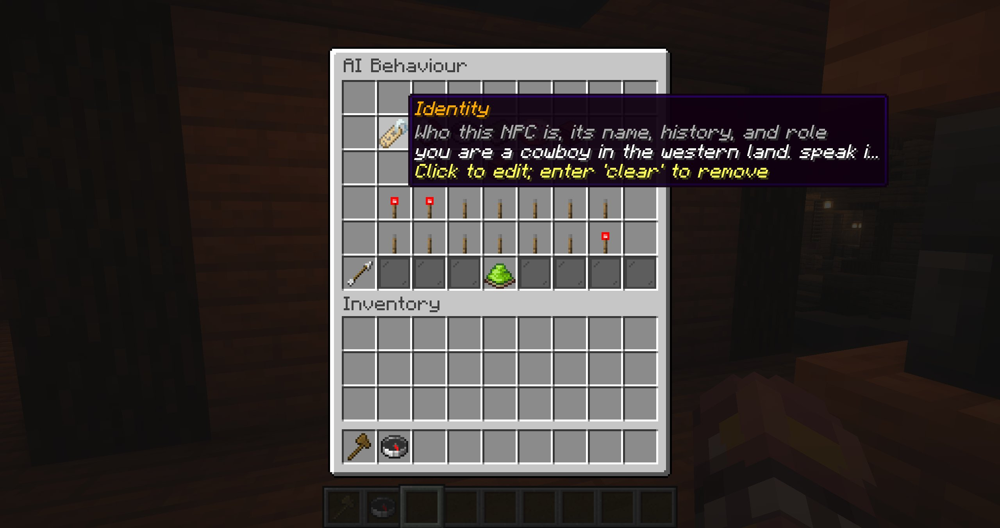
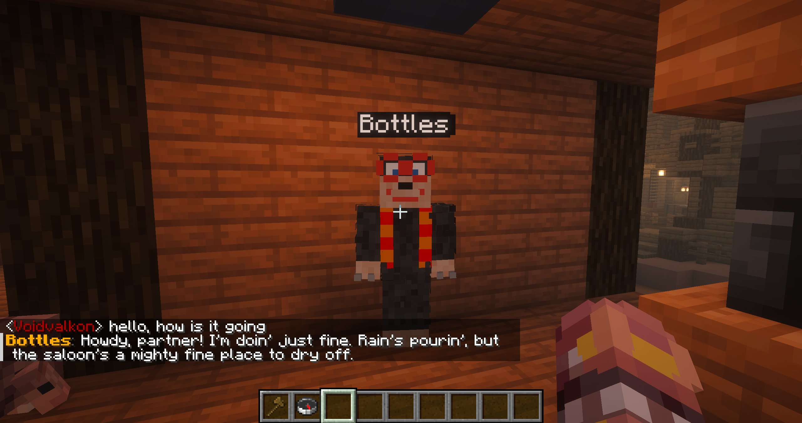

# AI behaviour

AI behaviour is an optional OpenRouter-powered layer. The model receives bounded context and proposes gameplay actions through native function calls. Blockfolk validates those calls against the preset's enabled actions and the request's target aliases before applying them. Requests run asynchronously, so deterministic behaviour is not delayed.

## Configure OpenRouter

Set at least the API key and model in `plugins/Blockfolk/config.yml`, then restart the server:

```yaml
openrouter:
  endpoint: "https://openrouter.ai/api/v1/chat/completions"
  api-key: "your-api-key"
  model: "deepseek/deepseek-v4-flash-0731"
  timeout-seconds: 12
  max-tokens: 1600
```

Keep the endpoint on HTTPS. The AI menu reports whether OpenRouter is ready.
Choose a model and provider that support native function calling for gameplay actions.

Conversation history is controlled separately under `ai-control`:

```yaml
ai-control:
  conversation-history-limit: 20
```

The limit counts stored conversation lines, not complete back-and-forth turns. Set it to `0` to disable runtime conversation history.

## Describe the NPC

Open an NPC preset and choose **AI Behaviour**. Configure one or more context sections:

| Section | What to write |
| --- | --- |
| Identity | Who the NPC is, including its name, history, and role. |
| Personality & Behaviour | How it speaks, reacts, and treats others. |
| Goal / Role | What it should accomplish or prioritize. |
| Knowledge / Information | Lore, facts, rules, and local knowledge it may use. |
| Likes & Dislikes | Things it enjoys, avoids, values, or strongly dislikes. |

At least one section is required before AI behaviour can be activated.

## Choose triggers

Add **AI Trigger** to any standard event, custom event, waypoint, or question branch. A dialog asks for an optional prompt
to guide the AI for that specific trigger. Leave it empty to use the surrounding event as the request reason without
extra guidance.

Enable **Respond to Nearby Chat** for direct player conversation within eight blocks. One chat message creates a coordinated request for up to five eligible NPCs. A named NPC is the intended speaker; otherwise the closest NPC is. If that NPC is busy, the turn waits for it rather than moving to another speaker.

### NPC names and aliases

Group requests use readable Response IDs such as `npc_mr_mario_1234567890abcdef` to route function calls to the right NPC. Each ID combines a normalized display name with a suffix from that spawned instance's persistent ID, so duplicate names remain distinct and group order does not change the ID. The display name appears beside the ID in both the system context and participant heading. The player's exact chat message is included, so a message such as “Mr. Mario, how is your day?” selects **Mr. Mario** as the intended speaker.

If a group response omits the intended speaker, Blockfolk asks that NPC separately and keeps valid actions from the other NPCs. A silent intended speaker can use **Do Nothing**.

## Restrict capabilities

Every capability is toggled per preset. **Start/Stop Combat**, **Follow/Unfollow**, and **Start/Pause Route** each use one switch that enables both actions. Other controls include speech, animations, fleeing, interacting, moving, mining, and returning home. **Do Nothing** is always available.

For an **On Damage Taken** AI Trigger that should retaliate, enable **Start/Stop Combat** in AI Behaviour and set the NPC's maximum health above zero in **Fighting & Survival**. The prompt can ask the NPC to attack its attacker, but cannot enable a disabled capability. When the attacker is known, the request exposes it as `triggering_entity`; a valid combat target must still be alive and attackable when the model responds. For guaranteed retaliation, put the regular **Start Combat** action on the damage event and use AI Trigger for optional speech or other reactions.

The model cannot issue commands, executable code, arbitrary coordinates, or unlisted entity identifiers. A disabled, malformed, or unadvertised function call is rejected.

## Inventory and world interaction

Enable **Temporary Inventory** when the AI should see and manipulate the items carried by each instance. This also enables container transfers and direct collection of mined drops. If mined drops do not fit, the block remains untouched. Without temporary inventory, mined blocks drop items naturally.

## Conversation and memory

Conversation can be:

- **Private** — each player has a separate conversation with that NPC instance;
- **Shared** — all players contribute to one conversation on that instance.

Long-term memory is separately optional. It stores up to 45 facts on the preset, shared by all its instances and retained across restarts. After each completed player conversation turn, the AI reviews the conversation in a background memory pass about every ten lines, with the previous exchange included for context. It also reviews shorter conversations after 30 seconds without player interaction. It may save durable preferences, plans, promises, agreements, or deals; if there is nothing useful to retain, it saves nothing. When a new fact is saved, the players in that conversation see an "NPC remembered this..." chat notice. Administrators can add, edit, delete, or clear facts in the memory menu.

The number of recent conversation lines supplied to the model is set globally with `ai-control.conversation-history-limit`. Its default is `20`; when the limit is exceeded, the oldest lines are discarded first.

Opening a preset's admin editor resets runtime AI state and queued interactions for every spawned copy of that preset. Durable long-term facts remain until edited or cleared.

## Request lifecycle

While a request is in flight, a hologram cycles through `Thinking.`, `Thinking..`, and `Thinking...`. The AI can use up to three model rounds in a gameplay turn, receiving tool results and updated NPC state between rounds. Each NPC is limited to eight actions per turn. Requests have a per-NPC cooldown in addition to trigger throttling. Up to eight waiting chat turns per player and eight waiting AI events per NPC are kept in arrival order. Queued chat turns expire after 30 seconds; queued events expire after 15 seconds. Unusable action calls are logged and retried once before the turn is abandoned. Long-term memory review still uses JSON output.

For the exact prompt structure, perception limits, target aliases, and memory rules, see [AI request context](/reference/ai-request-context).

<div class="screenshot-grid">
  
  
</div>
