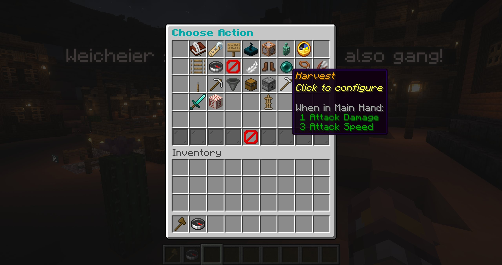

# Behaviour routines

Behaviour routines connect an event to a row of up to seven actions. Add more rows for the same event when you need more actions. Matching rows run in their displayed order, with actions running from left to right within each row.

## Events

The standard editor provides these triggers:

- lifecycle: **On Spawn**, **On Idle**, and **On Death**;
- players: **On Left-Click**, **On Right-Click**, **On Player Approach**, and **On Player Leaves**;
- combat and health: **On NPC Attacked**, **On Damage Taken**, **On Low Health**, **On Heal**, **On Combat Entered**, and **On Combat Exited**;
- world: **On Entity Nearby**, **On Route Point Reached**, **On Drop Item**, and **On Receive Item**;
- time: **At Sunrise**, **At Noon**, and **At Sunset**.

Nearby chat is configured from the AI menu rather than shown as a deterministic behaviour row.

## Actions

| Group | Available actions |
| --- | --- |
| Dialogue & scripting | Send Dialog, Show Holo Dialog, Ask Question, Emit Custom Event, Run Console Command, AI Trigger, Wait |
| Movement | Set Route, Start/Stop Navigation, Set Walk Speed, Move To, Teleport To, Follow, Unfollow |
| World & inventory | Interact, Mine Blocks, Take Item, Show Inventory, Drop Inventory, Harvest |
| Combat | Start Combat, Change Fight Options |
| Animation | Sleeping, Swimming, Fall Flying, Standing, Sneaking, Wave, Jump |

Click **Add Event Row**, choose an event, then fill that row's action slots. You can choose the same event again to extend its sequence. Left-click an action to replace it and right-click to remove it. Right-click an event icon to remove its row. Shift-left-click an event row to copy its actions; shift-right-click another row to paste them.

  

## Questions

**Ask Question** displays a prompt with up to four distinct answers. Each answer and the cancel/timeout path can have its own action branch. A branch supports up to seven actions and cannot contain another question. The global question timeout is configured in [`config.yml`](/reference/configuration).

## Dialog timing

Dialog line duration is calculated at 12 characters per second with a minimum of three seconds.

## Custom events

Custom events decouple one routine from another. Define global custom events in the custom-event manager, add **Emit Custom Event** to a source routine, then configure a preset's **Custom Event Behaviour** for that event.

Names may contain `/` to create groups in the event browser. Custom-event actions can also emit another event, which makes it possible to coordinate several NPC presets.

See [Custom events](/features/custom-events) for creation, manual triggering, ordering, event chains, and deletion behavior.

## Waypoint actions

Route points may have their own action row. Shift-right-click a point while using the route editor to configure actions that run when that waypoint is reached.
