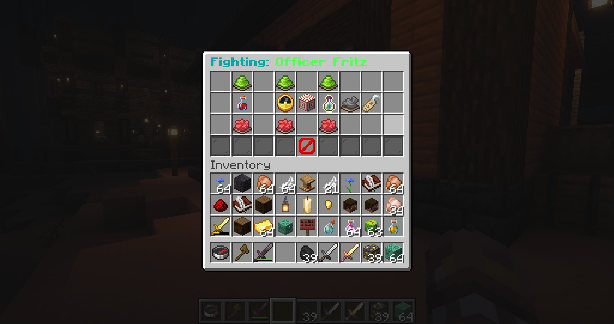
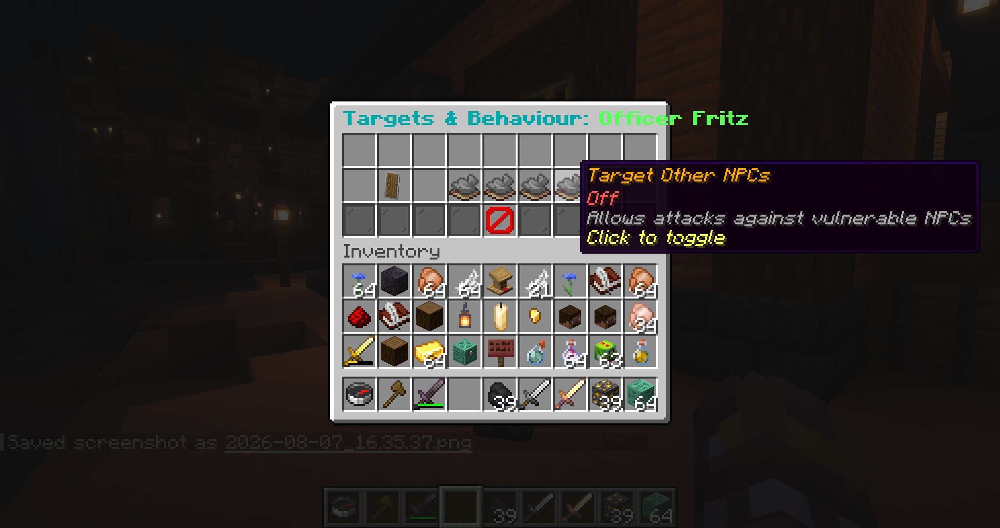
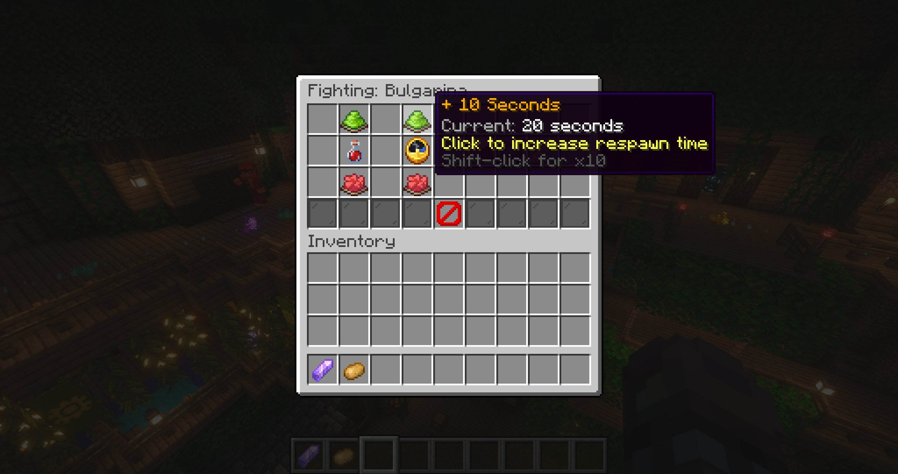

# Combat

Combat is configured per preset under **Fighting**.

  
  

## Health and respawning

- Maximum health ranges from `0` to `1024` and changes in steps of 5 (shift-click uses ten steps).
- A value of `0` makes the NPC invulnerable.
- Respawn time changes in 10-second steps. `0` disables respawning.
- A respawning NPC needs a preset spawnpoint.
- Dropped experience changes in steps of 5.
- The optional boss bar is visible to players within 16 blocks.

Pending combat respawns survive server restarts and keep the persistent instance UUID.

## Aggression

| Mode | Behaviour |
| --- | --- |
| Ignore | Does not retaliate or seek targets. |
| Fights Back | Retaliates after being attacked. |
| Flee | Moves away after being attacked. |
| Hunting | Proactively seeks enabled target categories. |

Target categories are non-animal mobs, animals, survival/adventure players, and other vulnerable Blockfolk NPCs.

## Alliances

NPCs with the same non-empty alliance value do not fight each other. Use a consistent spelling across the presets that should cooperate.

## Runtime combat actions

**Start Combat** starts an encounter from a behaviour routine. **Change Fight Options** temporarily changes aggression and target categories, allowing a routine to switch stance without modifying the stored combat profile.

AI combat is separately gated by the preset's enabled AI capabilities. The response still passes validated nearby targets only.

## Loot and experience

Experience is dropped when a vulnerable NPC dies. Items come from the independently rolled loot slots configured in [Customization & equipment](/features/customization).
