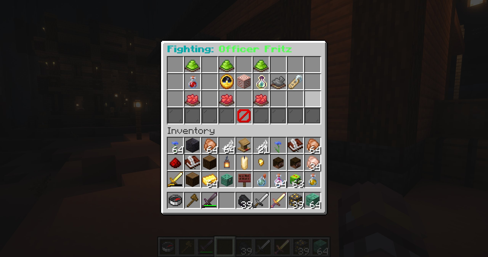
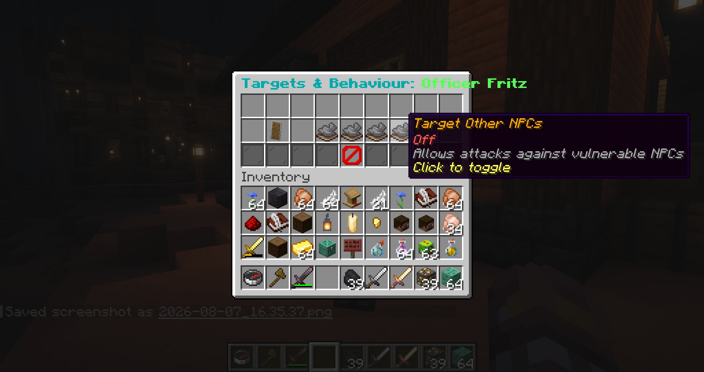
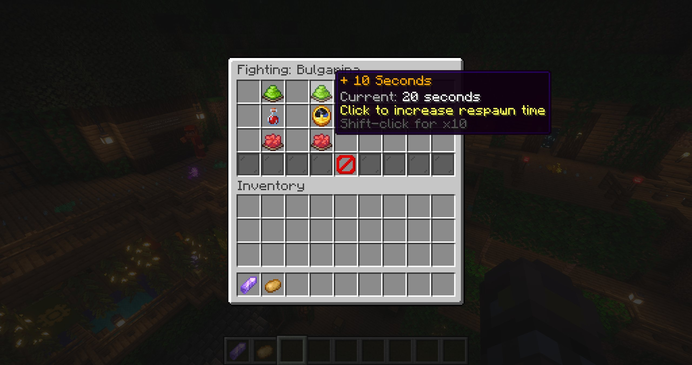

# Combat

Combat is configured per preset under **Fighting & Survival**.

  
  

## Health and respawning

- Maximum health ranges from `0` to `1024` and changes in steps of 5 (shift-click uses ten steps).
- A value of `0` makes the NPC invulnerable.
- Respawn time changes in 10-second steps. `0` disables respawning.
- A respawning NPC needs a preset spawnpoint.
- Dropped experience changes in steps of 5.
- The optional boss bar is visible to players within 16 blocks.

Pending combat respawns survive server restarts and keep the persistent instance UUID.

## Aggression

| Mode | Behaviour |
| --- | --- |
| Ignore | Does not retaliate or seek targets. |
| Fights Back | Retaliates after being attacked. |
| Flee | Moves away after being attacked. |
| Hunting | Proactively seeks enabled target categories. |

Target categories are non-animal mobs, animals, survival/adventure players, and other vulnerable Blockfolk NPCs.

## Special attacks

Open **Fighting & Survival → Special Attacks** to toggle the attacks a preset may use. These native abilities are inspired by BloodMoon and work without installing it. All attacks start disabled.

| Attack | Effect | Range | Cooldown |
| --- | --- | --- | --- |
| Life Drain | Deals 4 damage and heals the NPC by damage dealt, up to its maximum health. | 10 blocks | 16 seconds |
| Freezing Spell | Deals 2 damage and applies Slowness IV for 3 seconds. | 12 blocks | 14 seconds |
| Poison Spit | Deals 2 damage and applies Poison I for 4 seconds. | 12 blocks | 12 seconds |
| Wither Curse | Deals 2 damage and applies Wither I for 3 seconds. | 12 blocks | 16 seconds |
| Flame Burst | Deals 4 damage and ignites the target for 3 seconds. | 8 blocks | 12 seconds |
| Lightning Mark | Marks the target's position, then strikes for 6 damage. | 12 blocks | 20 seconds |
| Shockwave | Deals 4 damage and knocks back eligible targets around the NPC. | 4 blocks | 10 seconds |
| Fear | Deals 1 damage and applies Blindness I and Weakness I for 3 seconds. | 8 blocks | 14 seconds |

Damage values are health points: 2 points equal one heart. Armour, resistance, and cancelled damage events can reduce or prevent the effects.

The **Interval** controls how often an NPC attempts a special attack during combat. It defaults to about 8 seconds and can be adjusted from 3 to 60 seconds, in steps of 1 second (shift-click changes 5 seconds). The interval varies by up to 25%, with a minimum of 3 seconds. Each spawned instance has independent cooldowns. The NPC randomly chooses an enabled attack that is in range and ready; when none are ready, weapon combat continues.

Special attacks require active combat and maximum health above zero. They pause movement and weapon attacks for a one-second cast, shown by a particle ring. Moving more than 2 blocks from a spell's marked position dodges it; shockwave affects a 4-block radius. Attacks need line of sight at casting and impact. They respect alliances and protected players, and shockwave only hits the current opponent or enabled target categories. Cancelled or fully resisted damage also prevents healing, debuffs, fire, and knockback. Attacks do not modify blocks or summon entities.

The preset saves its enabled attacks and interval across restarts. **Change Fight Options** has the same Special Attacks menu, so behaviours, waypoints, and question branches can temporarily change the available attacks and cadence. Existing actions default to no special attacks.

## Alliances

NPCs with the same non-empty alliance value do not fight each other. Use a consistent spelling across the presets
that should cooperate. A player can appear allied to an NPC by carrying an item whose custom display name matches
that NPC's alliance. The comparison ignores capitalization and checks every inventory slot; allied NPCs will neither
choose that player as a target nor retaliate against them.

## Runtime combat actions

**Start Combat** starts an encounter from a behaviour routine. **Change Fight Options** temporarily changes aggression, target categories, and special attacks, allowing a routine to switch stance without modifying the stored combat profile.

AI combat is separately gated by the preset's enabled AI capabilities. The response still passes validated nearby targets only.

If the main hand and off hand contain a melee weapon and a bow or crossbow, the NPC uses the bow beyond three blocks and switches to melee within three blocks. The equipped hands return to their configured order when combat ends.

## Loot and experience

Experience is dropped when a vulnerable NPC dies. Items come from the independently rolled loot slots configured in [Customization & equipment](/features/customization).
