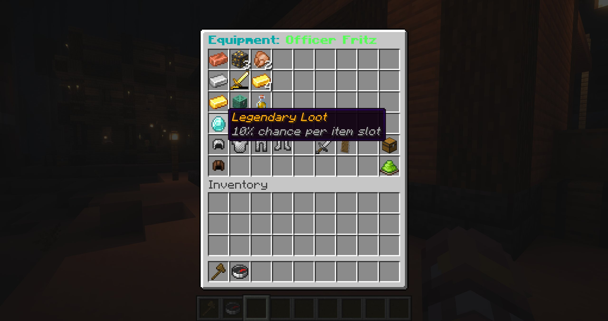

# Customization & equipment

## Appearance

The preset editor supports a display name and a skin URL or texture hash. Enter `default` when editing the skin to clear it. External image URLs are resolved through MineSkin; a MineSkin API key is optional but raises the public rate limit.

Under **NPC Properties**, you can configure:

| Property | Effect |
| --- | --- |
| Pushable | Allows players to move the NPC by colliding with it. |
| Show Name | Displays the name hologram above the NPC. |
| Look at Player | Turns toward the nearest player with a subtle body turn. |
| Item Pickup | Collects nearby item entities into that instance's temporary inventory. |
| Name Color | Cycles the color used for the visible NPC name. |

## Equipment & Loot

The **Equipment & Loot** editor stores helmet, chestplate, leggings, boots, main-hand item, and off-hand item. Select **Save Equipment & Loot** to persist the contents and refresh every spawned instance.

## Loot

The upper part of the equipment editor is a loot table. Every filled slot rolls independently when the NPC dies. Rows use these chances:

| Tier | Chance per filled slot |
| --- | ---: |
| Common | 100% |
| Uncommon | 50% |
| Rare | 25% |
| Legendary | 10% |

Loot is separate from the armor and held-item slots below it.

## Temporary inventory

Every instance can carry a temporary 27-slot inventory at runtime. Item pickup and several AI capabilities use it. Click the barrel in **Equipment & Loot** to pre-fill a preset's temporary inventory. New and respawned instances start with these items; existing active instances keep their current contents. Changes in this editor save when you leave it. The preset's **Temporary Inventory** AI option controls whether AI can perceive and manipulate those contents.
