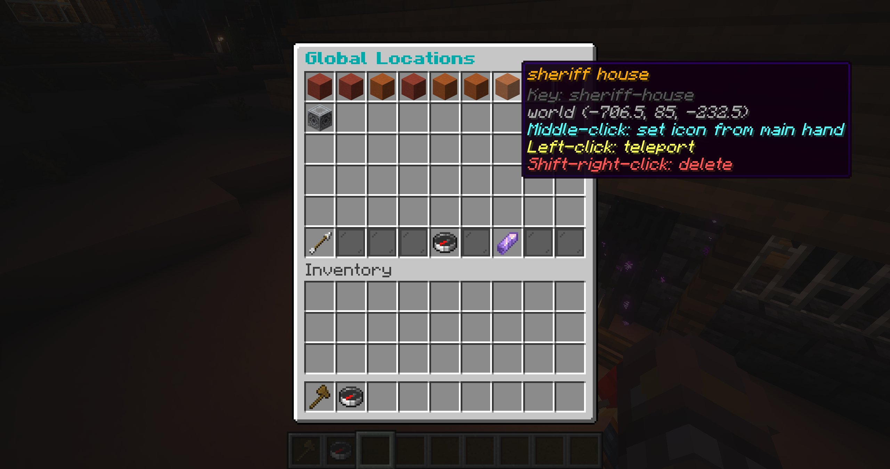

# Locations

Global locations are named destinations shared across NPC presets. Open `/bf locations` directly, or open `/bf routes`
and choose **Manage Locations**.

## Create locations

1. Select **Edit Locations** to receive the location editor shard.
2. Left-click a block and enter a unique name in chat. Use `/` to organize it into groups, such as
   `Town/Market` or `Town/Shops/Forge`.
3. Repeat for additional locations.
4. Drop the shard to finish editing.

Right-click an existing location while editing to delete it. Saved locations are highlighted in green during the session.

## Manage locations

From the locations browser:

- left-click a location to teleport to it;
- middle-click to set or clear its icon from your main hand;
- shift-right-click to delete it.

Click a group to browse its locations. Custom location icons are also shown when choosing a saved location for a
**Move To** action. Click **Location Overview** to reorder all locations, then pick up and drop icons and save the new
order.

## How locations are used

**Move To** and **Teleport To** behaviour actions can target a saved location. AI perception includes up to 15 nearby locations in the same world within 64 blocks, ordered nearest first and exposed through safe request-local aliases rather than arbitrary coordinates.

Locations differ from routes: a location is one destination, while a route is a closed sequence of walking points.

