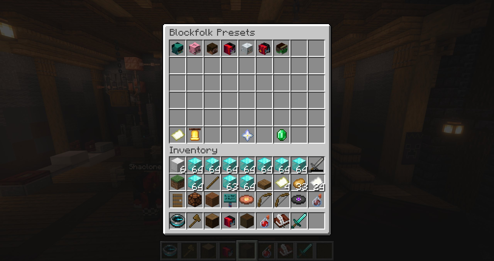
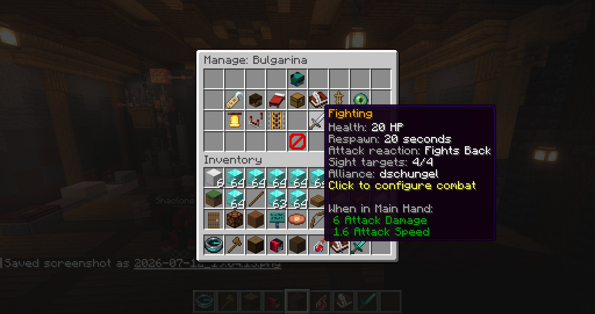

# NPCs & instances

NPC administration starts in the preset browser opened by `/bf`.

## Create and organize presets

Create a preset with `/bf create <name>` or from the browser. Its stable key is derived from the initial name; the visible display name can be changed later. The browser supports paging and duplicating presets.

To customize the preset order, click **Blockfolk Overview** at the bottom of the preset browser. In **Reorder NPC Presets**, pick up and drop preset icons into their desired positions, then choose **Save Order**. The saved order controls the main NPC browser and the NPC folders shown in the route manager.

Opening a preset gives access to:

- display name, skin, and preset spawnpoint;
- NPC properties and name color;
- equipment and loot;
- event and custom-event behaviour;
- AI behaviour and combat;
- spawning and managing persistent instances.

  
  

## Preset spawnpoint

Select **Preset Spawnpoint** to save your current position. The spawnpoint is used for the first spawn and for combat respawning. Configure it before enabling a non-zero combat respawn time.

## Spawned instances

The first visible copy is created with **Spawn NPC**. After that, **Manage Instances** shows all copies of the preset and lets you add or remove instances.

When a preset has exactly one instance:

- shift-left-click **Manage Instances** to teleport to the NPC;
- shift-middle-click it to move the NPC and its respawn location to you.

Deleting an individual instance requires confirmation. Combat respawns preserve the instance UUID and pending deadline across restarts.

## Direct editing

An administrator with `blockfolk.admin` can hold Shift and right-click a spawned Blockfolk NPC to open its preset editor directly. This admin shortcut takes priority over the NPC's normal **On Right-Click** behaviour and BeautyQuests interaction.

## Edit and delete

Click the preset icon in its editor to open NPC properties. Shift-right-click the same icon to begin deletion. Preset changes are persisted automatically; equipment has an explicit **Save Equipment** control.

::: warning Integration references
An integration such as BeautyQuests targets a spawned instance, not merely the preset. Removing that instance breaks the external reference even if another copy of the same preset exists.
:::
