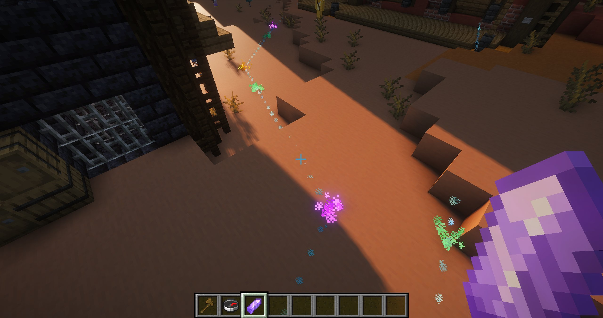
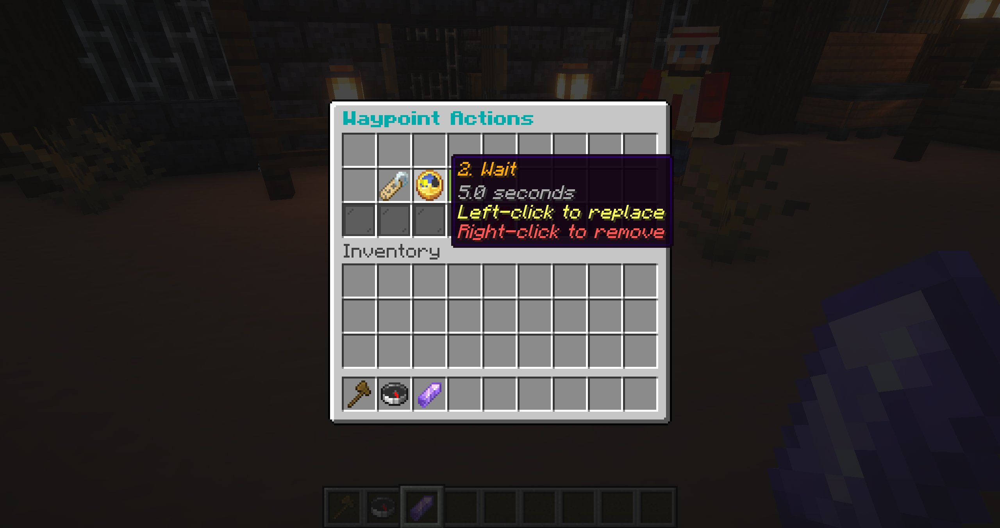

# Routes

Routes are reusable walking loops built directly in the world. Open the route manager with `/bf routes`.

## Create a route

1. Choose **Create Route** and enter a unique name in chat. Route keys may contain `/`, but the browser groups assigned routes by NPC rather than by name segments.
2. Open the new route. Blockfolk gives you a unique amethyst-shard route editor.
3. Left-click blocks to add points and right-click points to remove them.
4. Drop the editor shard to save and finish.

All points in one route must be in the same world. Points remain highlighted while editing.

## Point order

Point order is derived from position rather than placement order. An NPC starts at the point nearest to it, repeatedly visits the nearest unvisited point, then closes the loop from the final point back to the first.

## Waypoint actions

Shift-right-click a route point with the editor shard to attach an action sequence. These actions run when an NPC reaches that point and can pause, speak, interact, change movement, or invoke AI.

  
  

## Assign and control routes

Use these behaviour actions:

- **Set Route** selects the configured route;
- **Start Navigation** begins or resumes movement;
- **Stop Navigation** pauses it;
- **Set Walk Speed** chooses Slouch, Slow, Normal, Fast, or Very Fast.

AI can also start or pause the configured route when those capabilities are enabled.

## Route browser tools

The root route browser groups assigned routes under folders named after the NPC presets that reference them. Click an NPC folder to see all routes used by that preset. A route shared by multiple presets appears in each relevant folder; it is still one route, not a duplicate. Routes that no preset references remain visible directly at the root.

NPC folders follow the saved NPC preset order. Within those folders—and for unassigned routes at the root—routes follow the saved route order. This grouping can make a route appear to have moved after it is assigned even though its ordering has not changed.

To customize route order, click **Route Overview** at the bottom of the route browser. In **Reorder Routes**, pick up and drop route icons, then choose **Save Order**. Middle-click a route to use your main-hand item as its browser icon. Deleting a route removes direct and question-branch references and unassigns affected presets.
