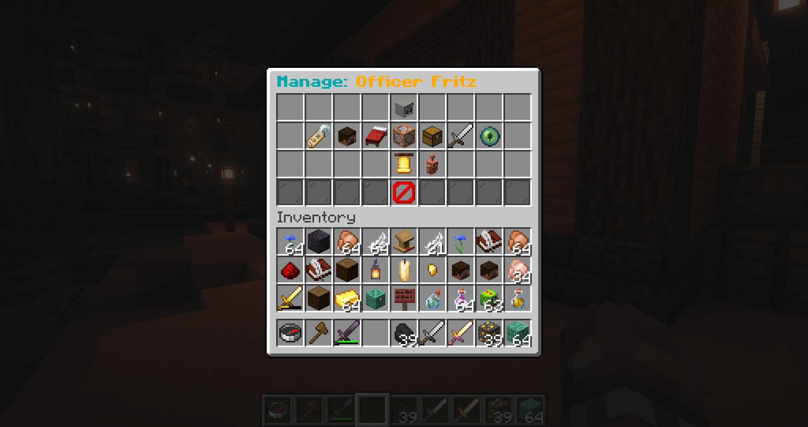

# Getting started

## Requirements

- A Paper 26.2 server
- Java 25
- Operator access or the `blockfolk.admin` permission
- OpenRouter credentials only if you intend to use [AI behaviour](/features/ai-behaviour)

## Install Blockfolk

1. Download `Blockfolk.jar` from the [latest GitHub release](https://github.com/andreasjhagen/Blockfolk-NPC/releases/latest).
2. Stop the server and place the jar in its `plugins` directory.
3. Start the server. Blockfolk creates its configuration and data under `plugins/Blockfolk/`.
4. Run `/bf`. If the preset browser opens, installation is complete.

::: tip Optional integration
Install BeautyQuests before starting the server if you want Blockfolk NPCs to appear in its NPC selectors. No extra Blockfolk setting is required.
:::

## Create your first NPC

1. Run `/bf create Shopkeeper`, or choose **Create NPC** in the preset browser and enter a name in chat.
2. Open the preset and select **Preset Spawnpoint** while standing where the NPC should appear.
3. Optionally set a skin, equipment, properties, combat, or behaviour.
4. Select **Spawn NPC**.

The preset is the reusable configuration. The visible NPC is an instance of that preset. Editing the preset refreshes its spawned copies where appropriate.



## Give it something to do

For a simple greeting:

1. Open the preset's **Event Behaviour** menu.
2. Find **On Player Approach** and add **Send Dialog**.
3. Enter the greeting in chat.

For movement, create a [route](/features/routes), assign it with a behaviour action, and start navigation. For contextual conversation, configure [AI behaviour](/features/ai-behaviour) and add an **AI Trigger** action.

## Build from source

```bash
mvn clean test package
```

The built plugin is written to `target/Blockfolk.jar`.
